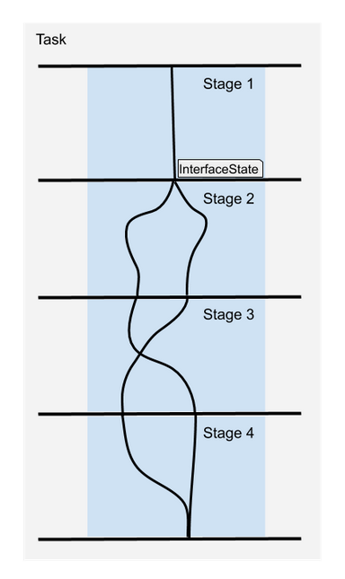
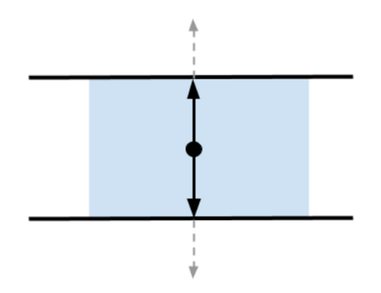
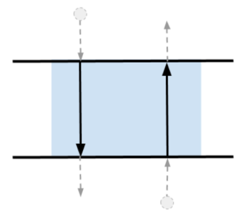
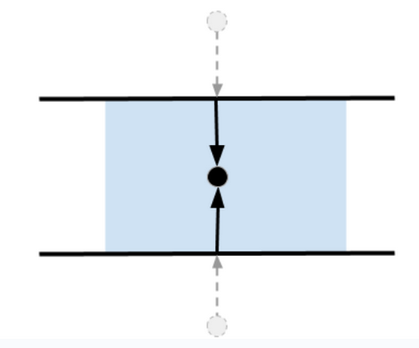

Basic Concepts
==============

What is MoveIt Task Constructor?
--------------------------------

| The MoveIt Task Constructor framework helps break down complex planning tasks to multiple interdependent subtasks.
| The top-level planning problem is specified as a Task while all subproblems are specified by Stages.
| The MTC framework uses MoveIt to solve the subtasks. Information from the subtasks are passes through the InterfaceState object.

MTC Stages
-----------
| A MTC stage refers to a component or step in the task execution pipeline.
| Stages can be arranged in any arbitrary order and their hierarchy is only limited by the individual stage types.
| The order in which stages can be arranged is restricted by the direction in which results are passed.
| Stages not only support solving motion planning problems. They can also be used for all kinds of state transitions, as for instance modifying the planning scene. Combined with the possibility of using class inheritance it is possible to construct very complex behavior while only relying on a well-structured set of primitive stages.

There are three possible stages types relating to the result flow:

* Generators

* Propagators

* Connectors

Generator Stage
^^^^^^^^^^^^^^^

| Generator stages get no input from adjacent stages. They compute results and pass them in both directions - forward and backward.
| Execution of a MTC task starts with the Generator stages.
| The most important generator stage is ``CurrentState``, which gets the current robot state as the starting point for a planning pipeline.

| Monitoring Generator is a stage that monitors the solution of another stage (not adjacent) to use the solutions for planning.
| Example of Monitoring Generator - ``GeneratePose``. It usually monitors a ``CurrentState`` or ``ModifyPlanning Scene`` stage. By monitoring the solutions of ``CurrentState``, the ``GeneratePose`` stage can find the object or frame around which it should generate poses.

| List of generator stages provided by MTC :ref:`Generating Stages`.

Propagating Stage
^^^^^^^^^^^^^^^^^

| Propagators receive solutions from one neighbor state, solve a problem and then propagate the result to the neighbor on the opposite side.
| Depending on the implementation, this stage can pass solutions forward or backward.
| Example of propagating stage - Move Relative to a pose. This stage is commonly use to approach close to an object to pick.

| List of propagating stages provided by MTC :ref:`Propagating Stages`.

Connecting Stage
^^^^^^^^^^^^^^^^

| Connectors do not propagate any results but attempt to connect the start and goal inputs provided by adjacent stages.
| A connect stage often solves for a feasible trajectory between the start and goal states.

| List of connecting stages provided by MTC :ref:`Connecting Stages`.

Wrapper
^^^^^^^
| Wrappers encapsulate another stage to modify or filter the results.
| Example of wrapper - Compute IK for Generate Grasp Pose stage. A Generate Grasp Pose stage will produce cartesian pose solutions. By wrapping an Compute IK stage around Generate Pose stage, the cartesian pose solutions from Generate Pose stage can be used to produce IK solutions (i.e) produce joint state configuration of robot to reach the poses.

| List of wrappers provided by MTC :ref:`Wrappers`.

MTC Containers
---------------
| The MTC framework enables the hierarchical organization of stages using containers, allowing for sequential as well as parallel compositions.
| A MTC container helps organize the order of execution of the stages.
| Programmatically, it is possible to add a container within another container.

Currently available containers:

* Serial

* Parallel

Serial Container
^^^^^^^^^^^^^^^^
| Serial containers organizes stages linearly and only consider end-to-end solutions as results.
| A MTC Task by default is stored as a serial container.

Parallel Container
^^^^^^^^^^^^^^^^^^
Parallel containers combine a set of stages to allow planning alternate solutions.

| More information on parallel containers :ref:`Parallel Containers`.
