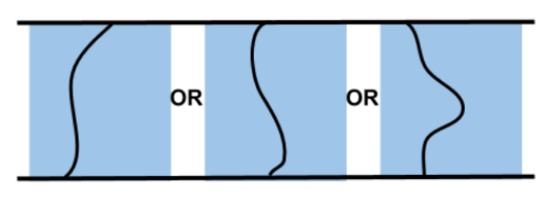
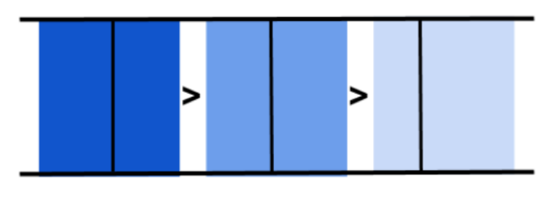
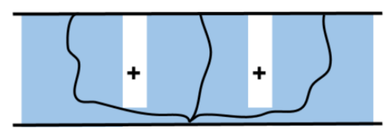

.. _Parallel Containers:

###################
Parallel Containers
###################

Parallel containers combine a set of stages to allow planning alternate solutions.

Three stages provided by MTC to use within a parallel container:

* Alternatives

* Fallback

* Merger

Alternatives
^^^^^^^^^^^^

| Alternatives container allow adding stages to be executed parallelly.
| All the solutions of the children stages are collected at the end and ordered by cost.
| Example - Plan a trajectory with multiple cost terms.

.. code-block:: c++

  auto pipeline{ std::make_shared<solvers::PipelinePlanner>(node) };

   auto alternatives{ std::make_unique<Alternatives>("connect") };
   {
       auto connect{ std::make_unique<stages::Connect>(
            "path length", stages::Connect::GroupPlannerVector{ { "panda_arm", pipeline } }) };
       connect->setCostTerm(std::make_unique<cost::PathLength>());
       alternatives->add(std::move(connect));
   }
   {
       auto connect{ std::make_unique<stages::Connect>(
            "trajectory duration", stages::Connect::GroupPlannerVector{ { "panda_arm", pipeline } }) };
       connect->setCostTerm(std::make_unique<cost::TrajectoryDuration>());
       alternatives->add(std::move(connect));
   }
   t.add(std::move(alternatives));

Fallbacks
^^^^^^^^^

| A fallback container executes children stages in order until one of them returns success or all stages return failure.
| Example - Plan with different solvers until we get successful solutions.

.. code-block:: c++

	auto cartesian = std::make_shared<solvers::CartesianPath>();
	auto ptp = std::make_shared<solvers::PipelinePlanner>(node, "pilz_industrial_motion_planner", "PTP")
	auto rrtconnect = std::make_shared<solvers::PipelinePlanner>(node, "ompl", "RRTConnectkConfigDefault")

  // fallbacks to reach target_state
  auto fallbacks = std::make_unique<Fallbacks>("move to other side");

  auto add_to_fallbacks{ [&](auto& solver, auto& name) {
       auto move_to = std::make_unique<stages::MoveTo>(name, solver);
       move_to->setGroup("panda_arm");
       move_to->setGoal(target_state);
       fallbacks->add(std::move(move_to));
   } };
  add_to_fallbacks(cartesian, "Cartesian path");
  add_to_fallbacks(ptp, "PTP path");
  add_to_fallbacks(rrtconnect, "RRT path");

Merger
^^^^^^

| Stages in a Merger container combine multiple distinct problems (i.e) plan for different planning groups in parallel.
| Solutions of all children are merged into a single solution for parallel execution.
| Example - Open gripper while moving the arm to a location

.. code-block:: c++

	auto cartesian_planner = std::make_shared<solvers::CartesianPath>();
	const auto joint_interpolation_planner = std::make_shared<moveit::task_constructor::solvers::JointInterpolationPlanner>();

	auto merger = std::make_unique<Merger>("move arm and close gripper");

  auto move_relative = std::make_unique<moveit::task_constructor::stages::MoveRelative>("Approach", cartesian_planner);
   merger->add(std::move(move_relative));

  auto move_to =
     std::make_unique<moveit::task_constructor::stages::MoveTo>("close gripper", joint_interpolation_planner);

  merger->add(std::move(move_to));
